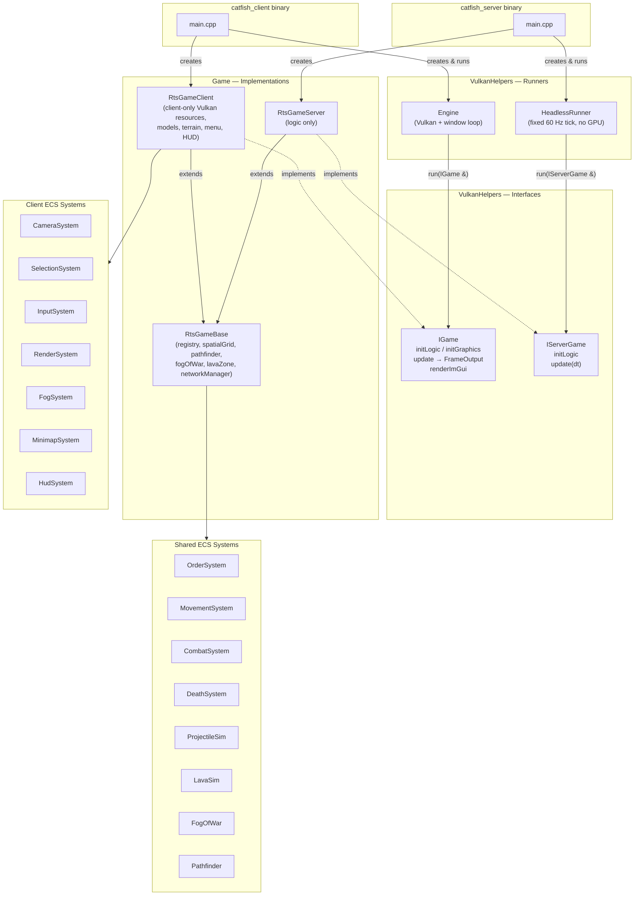
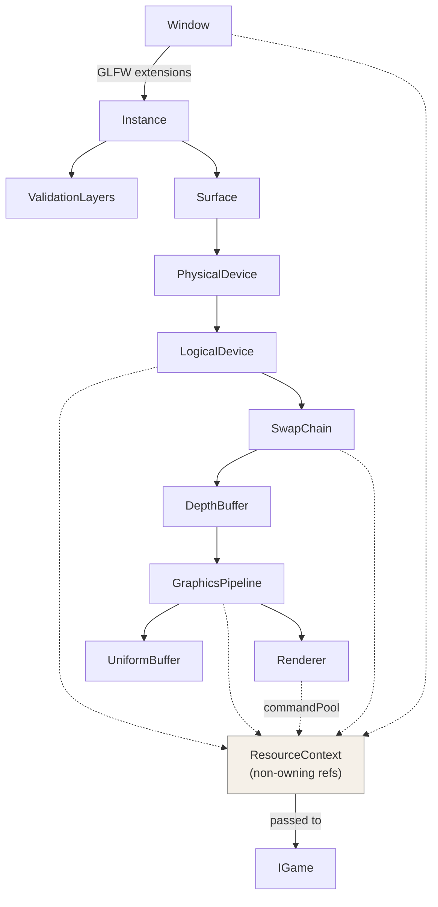
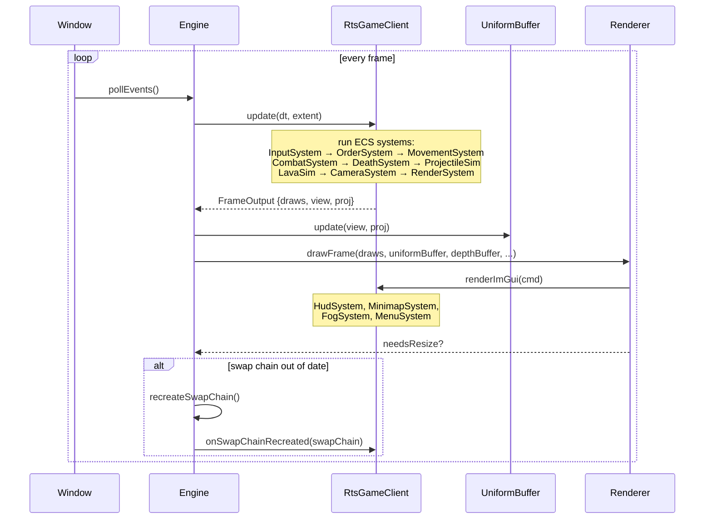
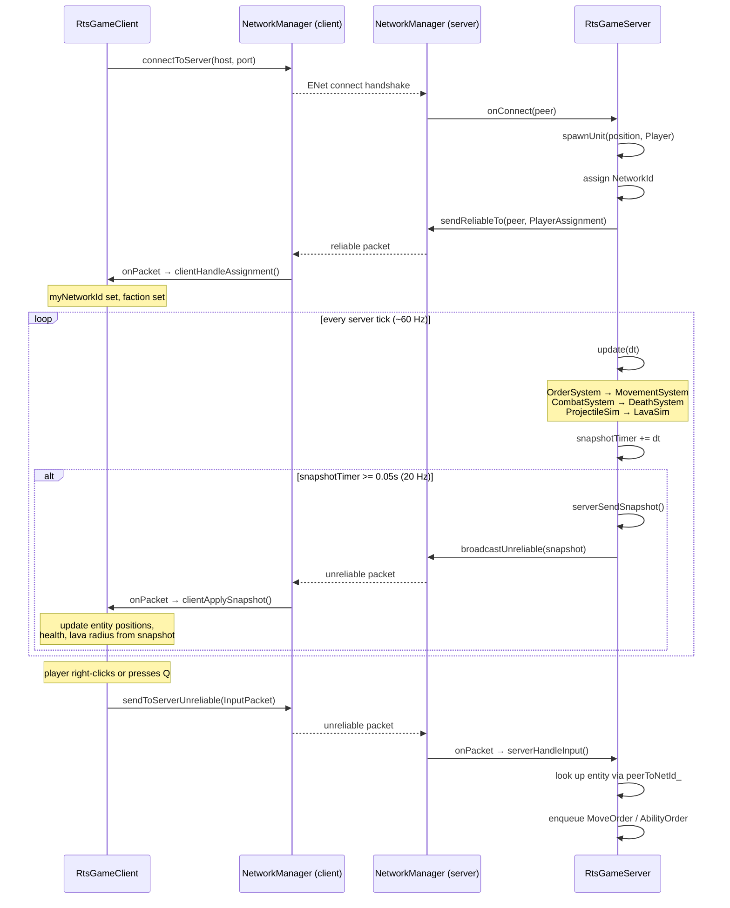

# Catfish Engine — Architecture Diagrams

## 1. System Architecture

High-level view of the two binaries, the runner/interface layer, and shared game base.

---

## 2. Vulkan Stack (Engine-owned objects)

Init order from top to bottom. `ResourceContext` bundles non-owning refs passed to `IGame::initGraphics`.

---

## 3. Sequence — Engine Frame Loop (client)

One iteration of the `Engine::run` while-loop.

---

## 4. Sequence — Network: connect, snapshot, and input

Client connects to server, receives unit assignment, then exchanges snapshots and input each tick.

